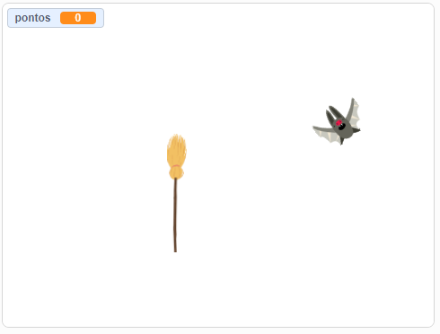
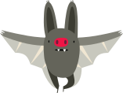
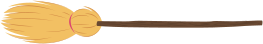

# Jogo Mata Morcego 

Jogo básico onde o desafio é bater ao morcego para poder ganhar, inspirado no jogo desenvolvido em SCRATCH. Foi fornecido um [projeto](https://scratch.mit.edu/projects/500885674) no sistema web [SCRATCH](https://scratch.mit.edu), que realiza um jogo basico.

## Recursos
### Morcego
#### Imagens
Arquivos:
* assets/morcego1.png
* assets/morcego2.png
* assets/morcego3.png
* assets/morcego4.png

#### Audio
Arquivos:
* assets/morcego.wav

### Vasoura
#### Imagens
Arquivos:
* assets/vasoura.png

#### Audio
Arquivos:
* assets/matou.wav
## Actividades para programar
### Parte1: Voar no eixo X sem sair da tela
Fazer que o morcego se movimente constantemente no eixo X, mas quando chegue no limite da tela ele volte no sentido invertido.
### Parte2: Voar no eixo Y sem sair da tela
Fazer que o morcego se movimente constantemente no eixo Y, mas quando chegue no limite da tela ele volte no sentido invertido.
### Parte3: Voar Aleatoriamente sem sair da tela
Fazer que o morcego se movimente constantemente tendo em consideracao um angulo, e quando chegue na borda(choque) voe em sentido aleatorio.
### Parte4: Simular voo do morcego
Existem 4 imagens correlativas do morcego para poder simular o movimento, realizar troca entre todas as imagens cada certo tempo para simular voo.
### Parte5: Vasoura seguir ao mouse
Fazer que apareca a vasoura, e que se movimente conforme ao movimento do mouse.
### Parte6: Matar morcego
Cada vez que o jogados faza clic, se valide se o clic foi feito sobre o morcego ou nao.
Caso que seja batido o morcego, toque o som `matou.wav` e que o morcego apareca em algum outro lugar da tela Aleatoriamente. 
### Parte7: Contabilizar pontos 
Criar um contador de quantas vezes matou o morcego e mostrar na tela.
